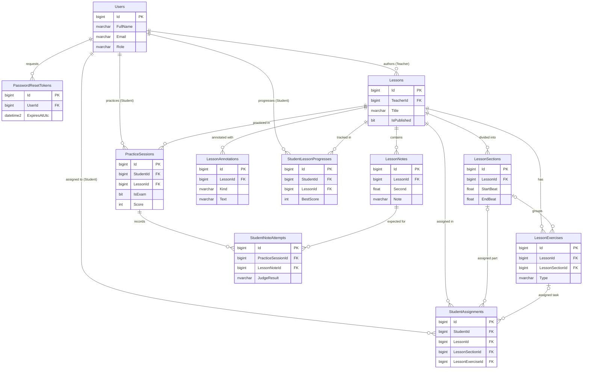

# Phần 6: Thiết kế Database (Music IBook)

> [!NOTE]
> Database được thiết kế dựa trên SQL Server và Entity Framework Core 8. Lược đồ bao gồm 11 bảng nghiệp vụ, tổ chức theo 3 nhóm chính: Identity (Tài khoản), Authoring (Biên soạn) và Learning (Học tập & Lịch sử).

## 6.1 Sơ đồ thực thể kết hợp (ERD)

Sơ đồ ERD khái quát hiển thị 11 bảng nghiệp vụ và mối quan hệ chính giữa các bảng. Khóa chính của tất cả các bảng đều là `bigint IDENTITY`.

> [!WARNING] Schema Drift
> Khai báo trong `MusicIBookDbContext` cho thấy quan hệ `Lessons` → `LessonExercises` là **Restrict**, nhưng `ModelSnapshot` hiện đang là **Cascade**. Cần cập nhật Migration để đồng bộ trước khi deploy production nhằm tránh lỗi khi xóa bài học.

---

## 6.2 Chi tiết Từ điển dữ liệu (Data Dictionary)

Dưới đây là đặc tả chi tiết của 11 bảng, bao gồm mục đích, màn hình phục vụ và thông tin từng cột.

### 1. Bảng `Users`
- **Mục đích:** Quản lý tài khoản, phân quyền và xác thực người dùng.
- **Màn hình phục vụ:** Login, Register, Profile, Teacher student management.

| Cột | Kiểu dữ liệu | Ràng buộc | Ý nghĩa |
| :--- | :--- | :--- | :--- |
| `Id` | bigint | PK, identity | Định danh người dùng |
| `FullName` | nvarchar(max) | not null | Họ tên hiển thị |
| `Email` | nvarchar(450) | unique, not null | Email đăng nhập |
| `PasswordHash` | nvarchar(max) | nullable | BCrypt hash (nullable cho legacy Google auth) |
| `AuthProvider` | nvarchar(max) | not null | Nguồn xác thực (hiện dùng `Local`) |
| `ProviderKey` | nvarchar(max) | nullable | ID nhà cung cấp cũ (nếu có) |
| `Role` | nvarchar(max) | not null | Vai trò (`Teacher` hoặc `Student`) |
| `CreatedAtUtc` | datetime2 | not null | Thời điểm tạo tài khoản (UTC) |

### 2. Bảng `PasswordResetTokens`
- **Mục đích:** Lưu trữ OTP/Token để người dùng đặt lại mật khẩu.
- **Màn hình phục vụ:** Forgot Password, Reset Password.

| Cột | Kiểu dữ liệu | Ràng buộc | Ý nghĩa |
| :--- | :--- | :--- | :--- |
| `Id` | bigint | PK, identity | Định danh token |
| `UserId` | bigint | FK (Users) | Trỏ đến người dùng yêu cầu |
| `Token` | nvarchar(max) | not null | Mã băm HMAC của OTP (không lưu OTP rõ) |
| `ExpiresAtUtc` | datetime2 | not null | Thời điểm hết hạn (sau 10 phút) |
| `IsUsed` | bit | not null | Ngăn chặn sử dụng lại OTP cũ |

### 3. Bảng `Lessons`
- **Mục đích:** Bản ghi gốc của bài học và bản nhạc MIDI.
- **Màn hình phục vụ:** Teacher editor/list; Student home/detail/practice/exam.

| Cột | Kiểu dữ liệu | Ràng buộc | Ý nghĩa |
| :--- | :--- | :--- | :--- |
| `Id` | bigint | PK, identity | Định danh bài học |
| `TeacherId` | bigint | FK, Restrict | Giáo viên sở hữu bài học |
| `Title` | nvarchar(max) | not null | Tên bài nhạc / bài học |
| `Composer` | nvarchar(max) | not null | Tên tác giả bản nhạc |
| `Clef` | nvarchar(max) | not null | Khóa nhạc mặc định |
| `KeySignature` | nvarchar(max) | not null | Hóa biểu gốc |
| `TimeSignature` | nvarchar(max) | not null | Số chỉ nhịp chính |
| `TimeSignatureMap` | nvarchar(max) | not null | Các thay đổi nhịp (parse từ MIDI) |
| `TempoMap` | nvarchar(max) | not null | Các thay đổi tempo (parse từ MIDI) |
| `Tempo` | int | not null | BPM mặc định / gốc |
| `AudioUrl` | nvarchar(max) | nullable | URL file audio tham chiếu (backing track) |
| `AudioFileName` | nvarchar(max) | nullable | Tên file upload ban đầu |
| `CreatedAtUtc` | datetime2 | not null | Thời điểm tạo (UTC) |
| `IsPublished` | bit | not null | Trạng thái (0 = Nháp, 1 = Đã xuất bản) |

### 4. Bảng `LessonNotes`
- **Mục đích:** Dữ liệu từng nốt dùng chung để render OSMD, phát và chấm điểm practice/exam.
- **Màn hình phục vụ:** Teacher editor; Student detail/practice/exam; Analytics.

| Cột | Kiểu dữ liệu | Ràng buộc | Ý nghĩa |
| :--- | :--- | :--- | :--- |
| `Id` | bigint | PK, identity | Định danh nốt |
| `LessonId` | bigint | FK, Cascade | Bài học chứa nốt này |
| `Second` | float | not null | Thời điểm bắt đầu tính bằng giây |
| `StartBeat` | float | not null | Vị trí bắt đầu tính bằng phách |
| `DurationBeat` | float | not null | Trường độ tính bằng phách |
| `Velocity` | int | not null | Cường độ nhấn (MIDI velocity) |
| `Track` | int | not null | Số track MIDI |
| `TrackName` | nvarchar(max) | not null | Tên track MIDI |
| `Staff` | int | not null | Khuông nhạc (1 hoặc 2) |
| `Voice` | int | not null | Voice độc lập trong khuông |
| `Note` | nvarchar(max) | not null | Cao độ (ví dụ: `C4`, `F#4`) |
| `Duration` | nvarchar(max) | not null | Tên trường độ ký âm (quarter, eighth, etc.) |
| `Lyric` | nvarchar(max) | not null | Lời ca (nếu có) |
| `Chord` | nvarchar(max) | not null | Ký hiệu hợp âm |
| `Fingering` | nvarchar(max) | not null | Ký hiệu số ngón tay |

### 5. Bảng `LessonSections`
- **Mục đích:** Phân chia bài học thành các đoạn luyện tập nhỏ hơn.
- **Màn hình phục vụ:** Teacher authoring; Student lesson/practice.

| Cột | Kiểu dữ liệu | Ràng buộc | Ý nghĩa |
| :--- | :--- | :--- | :--- |
| `Id` | bigint | PK, identity | Định danh đoạn (section) |
| `LessonId` | bigint | FK, Cascade | Bài học cha |
| `Title` | nvarchar(max) | not null | Tên đoạn |
| `StartBeat` | float | not null | Phách bắt đầu của đoạn |
| `EndBeat` | float | not null | Phách kết thúc của đoạn |
| `DefaultTempo` | int | 30-300 | BPM đề xuất của đoạn |
| `Difficulty` | nvarchar(max) | not null | Mức độ (`Beginner`, `Intermediate`, `Advanced`) |
| `Hand` | nvarchar(max) | not null | Tay luyện tập (`Both`, `Right`, `Left`) |
| `SortOrder` | int | Unique/Lesson | Thứ tự hiển thị trong danh sách đoạn |

### 6. Bảng `LessonAnnotations`
- **Mục đích:** Gắn các ghi chú và ký hiệu sư phạm hiển thị bổ sung trên bản nhạc.
- **Màn hình phục vụ:** Teacher authoring; Student lesson detail.

| Cột | Kiểu dữ liệu | Ràng buộc | Ý nghĩa |
| :--- | :--- | :--- | :--- |
| `Id` | bigint | PK, identity | Định danh ghi chú |
| `LessonId` | bigint | FK, Cascade | Bài học cha |
| `StartBeat` | float | not null | Phách bắt đầu áp dụng |
| `EndBeat` | float | nullable | Phách kết thúc (có thể null nếu tại 1 điểm) |
| `Kind` | nvarchar(max) | not null | Loại: Finger, Dynamic, Articulation, Pedal... |
| `Text` | nvarchar(max) | not null | Nội dung hiển thị |

### 7. Bảng `LessonExercises`
- **Mục đích:** Cấu hình các loại bài tập cụ thể cho toàn bài hoặc một section.
- **Màn hình phục vụ:** Teacher authoring; Student lesson/practice.

| Cột | Kiểu dữ liệu | Ràng buộc | Ý nghĩa |
| :--- | :--- | :--- | :--- |
| `Id` | bigint | PK, identity | Định danh bài tập (exercise) |
| `LessonId` | bigint | FK, Restrict | Bài học cha |
| `LessonSectionId` | bigint | FK, SetNull | Đoạn áp dụng (null = toàn bài) |
| `Title` | nvarchar(max) | not null | Tên bài tập |
| `Type` | nvarchar(max) | not null | Phân loại (1 trong 6 loại thiết kế) |
| `Instruction` | nvarchar(max) | not null | Hướng dẫn chi tiết cho học sinh |
| `ConfigJson` | nvarchar(max) | not null | Chuỗi JSON chứa cấu hình riêng theo từng Type |
| `SortOrder` | int | indexed | Thứ tự hiển thị bài tập |

### 8. Bảng `StudentAssignments`
- **Mục đích:** Các bài tập/yêu cầu được giáo viên giao đích danh cho một học sinh.
- **Màn hình phục vụ:** Teacher analytics/assign; Student lesson detail/practice.

| Cột | Kiểu dữ liệu | Ràng buộc | Ý nghĩa |
| :--- | :--- | :--- | :--- |
| `Id` | bigint | PK, identity | Định danh giao bài |
| `StudentId` | bigint | FK, Restrict | Học sinh được giao |
| `LessonId` | bigint | FK, Restrict | Bài học gốc |
| `LessonSectionId` | bigint | FK, SetNull | (Optional) Yêu cầu tập đoạn cụ thể |
| `LessonExerciseId` | bigint | FK, SetNull | (Optional) Yêu cầu làm bài tập cụ thể |
| `Message` | nvarchar(max) | not null | Lời dặn dò của giáo viên |
| `DueAtUtc` | datetime2 | nullable | Hạn chót hoàn thành (nếu có) |
| `CreatedAtUtc` | datetime2 | not null | Ngày giao bài (UTC) |
| `IsCompleted` | bit | not null | Trạng thái (đã luyện xong hay chưa) |

### 9. Bảng `StudentLessonProgresses`
- **Mục đích:** Thống kê tổng hợp tiến độ của một học sinh trên một bài học (để load nhanh danh sách).
- **Màn hình phục vụ:** Student detail/progress; Teacher student management.

| Cột | Kiểu dữ liệu | Ràng buộc | Ý nghĩa |
| :--- | :--- | :--- | :--- |
| `Id` | bigint | PK, identity | Định danh |
| `StudentId` | bigint | FK (Users) | Học sinh |
| `LessonId` | bigint | FK (Lessons)| Bài học tương ứng |
| `LastPositionSecond` | float | not null | Vị trí thời gian dừng lại gần nhất |
| `CompletedNoteCount` | int | not null | Số nốt lớn nhất đã hoàn thành |
| `BestScore` | int | not null | Kỷ lục điểm cao nhất |
| `TotalAttempts` | int | not null | Tổng số lần đã luyện / kiểm tra |
| `IsCompleted` | bit | not null | Cờ đánh dấu đã hoàn thành toàn bộ bài |
| `LastStudiedAtUtc` | datetime2 | not null | Thời điểm học gần nhất (UTC) |

### 10. Bảng `PracticeSessions`
- **Mục đích:** Lưu trữ kết quả tổng quát của mỗi phiên Practice hoặc Exam.
- **Màn hình phục vụ:** Practice/Exam result; History; Teacher analytics.

| Cột | Kiểu dữ liệu | Ràng buộc | Ý nghĩa |
| :--- | :--- | :--- | :--- |
| `Id` | bigint | PK, identity | Định danh phiên |
| `StudentId` | bigint | FK (Users) | Học sinh thực hiện |
| `LessonId` | bigint | FK (Lessons)| Bài học luyện tập |
| `IsExam` | bit | not null | Loại (`0` = Luyện tập, `1` = Kiểm tra) |
| `Score` | int | not null | Điểm tổng kết phiên |
| `CorrectCount` | int | not null | Số nốt đánh đúng |
| `WrongCount` | int | not null | Số nốt đánh sai / trượt |
| `Accuracy` | float | not null | Tỉ lệ chính xác (%) |
| `DurationSeconds` | int | not null | Thời lượng làm bài (giây) |
| `StartedAtUtc` | datetime2 | not null | Thời gian bắt đầu chơi (UTC) |
| `FinishedAtUtc` | datetime2 | nullable | Thời gian nộp bài / kết thúc (UTC) |
| `CreatedAtUtc` | datetime2 | not null | Ngày tạo bản ghi (UTC) |

### 11. Bảng `StudentNoteAttempts`
- **Mục đích:** Kết quả chi tiết đến từng nốt để dựng bản đồ nhiệt, tìm nốt hay sai, phục vụ phân tích.
- **Màn hình phục vụ:** Practice/Exam report; History; Teacher error analytics.

| Cột | Kiểu dữ liệu | Ràng buộc | Ý nghĩa |
| :--- | :--- | :--- | :--- |
| `Id` | bigint | PK, identity | Định danh attempt |
| `PracticeSessionId` | bigint | FK, Cascade | Phiên thực hiện chứa nốt này |
| `LessonNoteId` | bigint | FK, Restrict | Khóa ngoại trỏ đến nốt chuẩn |
| `ExpectedNote` | nvarchar(max) | not null | Nốt hệ thống yêu cầu chơi |
| `PlayedNote` | nvarchar(max) | not null | Nốt học sinh thực tế đánh vào |
| `ExpectedAtSecond` | float | not null | Thời điểm chuẩn cần bấm (giây) |
| `PlayedAtSecond` | float | not null | Thời điểm học sinh đã bấm (giây) |
| `TimingErrorMs` | float | not null | Độ lệch thời gian tính bằng milliseconds |
| `IsCorrectPitch` | bit | not null | Đã bấm đúng cao độ chưa |
| `IsCorrectTiming` | bit | not null | Bấm trong vùng dung sai thời gian chưa |
| `IsCorrect` | bit | not null | Kết quả boolean gộp chung |
| `JudgeResult` | nvarchar(max) | not null | Kết quả phán đoán: `PERFECT`, `GOOD`, `LATE`, `WRONG`, `MISS` |
| `CreatedAtUtc` | datetime2 | not null | Thời điểm ghi nhận (UTC) |

---
*Ghi chú chính sách cascade:*
- Khi xóa `Lessons`, các bảng `LessonNotes`, `LessonSections`, `LessonAnnotations` sẽ tự động xóa (Cascade).
- Khi xóa `PracticeSessions`, các `StudentNoteAttempts` thuộc session đó sẽ bị xóa (Cascade).
- Ràng buộc `Restrict` được áp dụng rộng rãi để ngăn việc vô ý xóa `Users` hoặc `LessonNotes` khi còn dữ liệu liên quan ở bảng khác.
